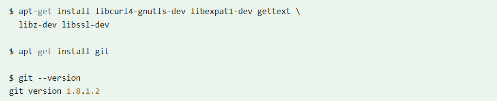

# 第一章 Git安装配置

## 1.1 Linux 平台上安装

Git的工作需要调用curl，zlib，openssl，expat，libiconv等库的代码，所以需要线安装这些依赖工具。

在有yum的系统上（比如Fedora）或者有apt-get的系统上（比如Debian体系），可以用下面的命令安装：

各Linux系统可以使用其安装管理工具（apt-get、yum等）进行安装：

### 1.1.1 Debian/Ubuntu

Debian/Ubuntu Git 安装命令为：

## 1.2 Windows 平台上安装